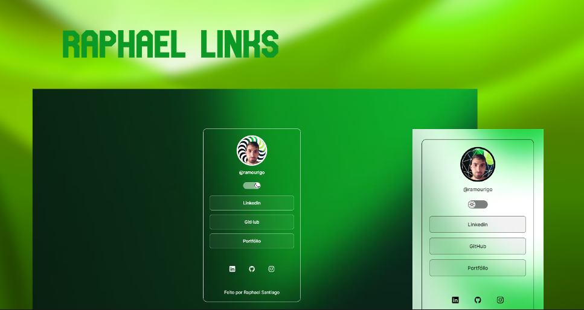

# Raphael Moura - Links 🧑‍💻

## Descrição 📋
Este projeto é uma página pessoal desenvolvida para compartilhar links importantes, incluindo perfis em redes sociais e portfólio. A página foi criada utilizando HTML, CSS e JavaScript, com o objetivo de relembrar, reforçar e melhorar os conhecimentos em desenvolvimento de aplicações web.

## Funcionalidades 📁

- Exibição da imagem de perfil e link do Instagram de Raphael Moura.
- Links para o perfil do LinkedIn, GitHub e portfólio pessoal.
- Alternância entre temas light e dark com um switch.
- Ícones das redes sociais com links para os respectivos perfis.
- Rodapé com créditos e descrição do propósito do projeto.

## Tecnologias 🚀

- HTML: Estruturação do conteúdo da página. 
- CSS: Estilização e layout responsivo da página.
- JavaScript: Implementação da funcionalidade de alternância de temas e integração dos ícones das redes sociais.

  

## Como Usar ⚙️
- Faça um clone deste repositório em seu ambiente de desenvolvimento ou entre nesse link (https://raphaelsant.github.io/RaphaelLinks/).
- Abra o arquivo "index.html" em um navegador da web.
- A página será carregada com o tema light por padrão.
- Clique no switch para alternar para o tema dark.
- Clique nos links para redirecionamento para os perfis do LinkedIn, GitHub e portfólio pessoal.

## Observações 🤔

- Certifique-se de estar conectado à internet para o carregamento dos ícones das redes sociais.
- Para a funcionalidade de alternância de temas, a classe "light" é adicionada à tag <html> para o tema light e removida para o tema dark.

## Autor 🤓

- [Raphael Moura Santiago]](https://github.com/RaphaelSant)

## Créditos 📍
Este projeto foi desenvolvido como parte do aprendizado e prática de desenvolvimento de aplicações web fornecido pela empresa RocketSeat. Fique à vontade para usar e modificar o código para suas necessidades, e qualquer feedback será bem-vindo!

## Licença 🗒️
Este projeto está licenciado sob a licença [MIT](https://choosealicense.com/licenses/mit/). Sinta-se à vontade para utilizar, modificar e compartilhar conforme os termos da licença.
